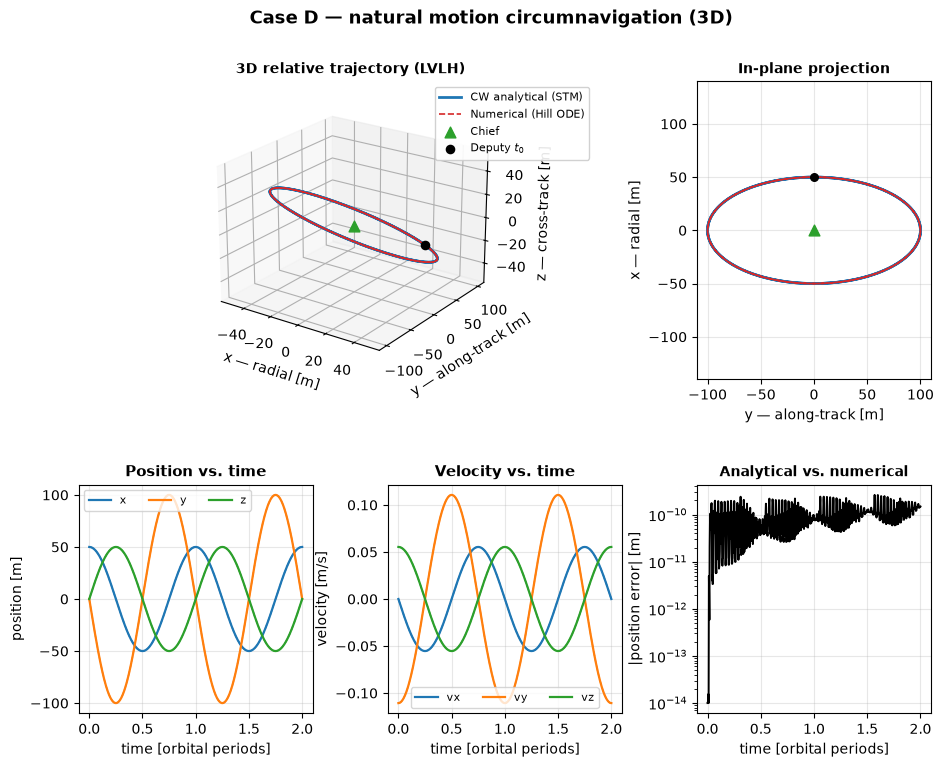

# ios-mission-planner

A Python toolkit for **in-orbit servicing (IOS) mission analysis and planning**.

The long-term goal is a mission planner that, given a deputy satellite on a parking orbit and a target (chief) satellite, computes an optimal sequence of maneuvers to bring the deputy from far-range phasing through close-range proximity operations to a final docking — accounting for orbital and attitude dynamics of both satellites, mission safety constraints (e.g. approach/keep-out ellipsoids), and eventually closed-loop relative navigation from noisy sensor data (e.g. LiDAR).

This is being built up incrementally, starting from the dynamics layer. What exists today:

- **Relative motion** between a chief and a deputy: the linearized Hill-Clohessy-Wiltshire (HCW) equations, both integrated numerically and solved in closed form via the Clohessy-Wiltshire state transition matrix (STM).
- **Absolute (inertial) motion**: the two-body problem, numerically integrated or propagated analytically via classical orbital elements and Kepler's equation, plus the J2 (Earth oblateness) perturbation.



*A drift-free, out-of-plane relative orbit (natural motion circumnavigation) around the chief, from [`examples/cw_comparison.ipynb`](examples/cw_comparison.ipynb): the CW closed-form solution and the numerical integration of the Hill equations agree down to numerical noise (bottom-right panel).*

## Installation

Requires Python >= 3.12.

```bash
git clone https://github.com/giovannifacchinetti99/ios-mission-planner.git
cd ios-mission-planner

python -m venv .venv
.venv\Scripts\activate        # Windows
# source .venv/bin/activate   # macOS/Linux

pip install -e .
```

This installs the package in editable mode, so changes to `src/` are picked up immediately without reinstalling.

To run the example notebooks you'll also need Jupyter:

```bash
pip install jupyter
```

## Contents

- `src/ios_mission_planner/dynamics/orbital/two_body.py` — Two-body equations of motion in an inertial frame, for absolute orbit propagation.
- `src/ios_mission_planner/dynamics/orbital/perturbations.py` — Two-body dynamics with J2 (oblateness) perturbation.
- `src/ios_mission_planner/dynamics/orbital/elements.py` — Conversions between inertial state vectors and classical orbital elements, and Kepler's equation solver.
- `src/ios_mission_planner/dynamics/orbital/kepler_propagator.py` — Closed-form (Keplerian) analytical propagation of the unperturbed two-body state.
- `src/ios_mission_planner/dynamics/relative/hill.py` — Hill-Clohessy-Wiltshire (HCW) equations of motion for a deputy relative to a chief on a circular reference orbit, for use with numerical integration.
- `src/ios_mission_planner/dynamics/relative/cw.py` — Closed-form Clohessy-Wiltshire state transition matrix for analytical propagation of relative motion.
- `src/ios_mission_planner/propagation/propagator.py` — Generic numerical propagator built on `scipy.integrate.solve_ivp`.
- `src/ios_mission_planner/constants.py` — Physical constants (gravitational parameter, radius, J2) for common central bodies.
- `examples/cw_comparison.ipynb` — Numerical vs. analytical comparison of relative motion (HCW/CW), across several representative cases (drift-free ellipse, V-bar hold point, natural motion circumnavigation, ...).
- `examples/two_body_comparison.ipynb` — Numerical vs. analytical comparison of absolute two-body motion, and the secular effect of the J2 perturbation.

## Usage

Relative motion (HCW), numerically integrated:

```python
import numpy as np
from ios_mission_planner.dynamics.relative.hill import hill_equations
from ios_mission_planner.propagation.propagator import propagate

n = 0.0011  # mean motion [rad/s]
state0 = np.array([100.0, 0.0, 0.0, 0.0, 0.0, 0.0])
t_span = (0, 5400)
t_eval = np.linspace(*t_span, 200)

solution = propagate(hill_equations, state0, t_span, t_eval, n=n)
```

Absolute (inertial) two-body motion, numerically integrated:

```python
import numpy as np
from ios_mission_planner.constants import MU_EARTH
from ios_mission_planner.dynamics.orbital.two_body import two_body_dynamics
from ios_mission_planner.propagation.propagator import propagate

state0 = np.array([6878.137, 0.0, 0.0, 0.0, 7.6126, 0.0])  # km, km/s
t_span = (0, 5677)
t_eval = np.linspace(*t_span, 200)

solution = propagate(two_body_dynamics, state0, t_span, t_eval, mu=MU_EARTH)
```

Absolute two-body motion, propagated analytically (Kepler):

```python
from ios_mission_planner.constants import MU_EARTH
from ios_mission_planner.dynamics.orbital.kepler_propagator import propagate_kepler

state_t = propagate_kepler(state0, t=5677.0, mu=MU_EARTH)
```
