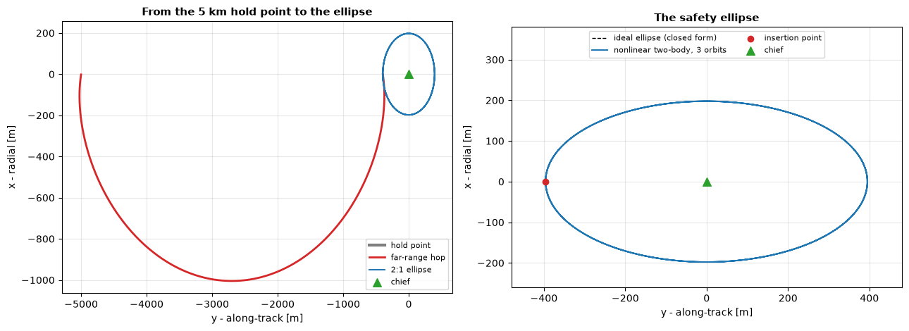
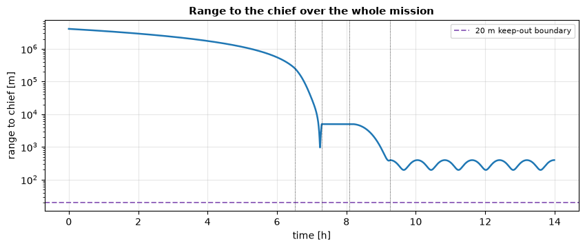

# ios-mission-planner

A Python toolkit for **in-orbit servicing (IOS) mission analysis and planning**: it designs the maneuvers that take a deputy satellite from a parking orbit to a safe rendezvous with a chief, flies them against nonlinear orbital dynamics instead of just the linear model used to design them, and checks the result for collision and safety risk.


*A drift-free, out-of-plane relative orbit (natural motion circumnavigation) around the chief, from [`examples/cw_fundamentals.ipynb`](examples/cw_fundamentals.ipynb): the closed-form Clohessy-Wiltshire solution and the numerical integration of the Hill equations agree down to numerical noise.*



*The far-range approach from a 5 km hold point onto a 2:1 safety ellipse, from [`examples/rendezvous_to_safety_ellipse.ipynb`](examples/rendezvous_to_safety_ellipse.ipynb): flown with nonlinear two-body dynamics, closing within a few metres of the design.*



*Range to the chief over the whole rendezvous mission, checked against a keep-out zone in [`examples/rendezvous_safety_assessment.ipynb`](examples/rendezvous_safety_assessment.ipynb): deterministic margin, passive safety, approach corridor, J2 station-keeping and a Monte Carlo collision probability all run on the same flown trajectory.*

## Installation

Requires [conda](https://conda.io) (e.g. [Miniforge](https://github.com/conda-forge/miniforge)). The dynamics modules depend on [heyoka.py](https://github.com/bluescarni/heyoka.py), which ships prebuilt binaries only through conda-forge (no Windows pip wheels), so this project is conda-first rather than pip/venv-based.

```bash
git clone https://github.com/giovannifacchinetti99/ios-mission-planner.git
cd ios-mission-planner

conda env create -f environment.yml
conda activate ios-mission-planner
```

`environment.yml` installs Python, heyoka.py, numpy, matplotlib, Jupyter, and the package itself in editable mode (via `pip install -e .` under the hood), so changes to `src/` are picked up immediately without reinstalling.

To run the example notebooks from this environment's Jupyter kernel:

```bash
python -m ipykernel install --user --name ios-mission-planner --display-name "Python (ios-mission-planner)"
```

## Usage

Relative motion (HCW), numerically integrated:

```python
import numpy as np
from ios_mission_planner.dynamics.relative.hill import hill_equations_symbolic
from ios_mission_planner.propagation.heyoka_propagator import propagate

n = 0.0011  # mean motion [rad/s]
state0 = np.array([100.0, 0.0, 0.0, 0.0, 0.0, 0.0])
t_eval = np.linspace(0, 5400, 200)

solution = propagate(hill_equations_symbolic(), state0, t_eval, pars=[n])
```

Absolute (inertial) two-body motion, numerically integrated:

```python
import numpy as np
from ios_mission_planner.constants import MU_EARTH
from ios_mission_planner.dynamics.orbital.two_body import two_body_dynamics_symbolic
from ios_mission_planner.propagation.heyoka_propagator import propagate

state0 = np.array([6878.137, 0.0, 0.0, 0.0, 7.6126, 0.0])  # km, km/s
t_eval = np.linspace(0, 5677, 200)

solution = propagate(two_body_dynamics_symbolic(), state0, t_eval, pars=[MU_EARTH])
```

Two-impulse targeting from a hold point at y = -1000 m to one at y = -200 m, in 0.75 orbits:

```python
import numpy as np
from ios_mission_planner.dynamics.relative.cw import cw_targeting

n = 0.0011  # mean motion [rad/s]
T = 2 * np.pi / n

dv1, dv2 = cw_targeting(
    r0=[0.0, -1000.0, 0.0], v0=[0.0, 0.0, 0.0],
    rf=[0.0, -200.0, 0.0], vf=[0.0, 0.0, 0.0],
    t=0.75 * T, n=n,
)
```

Checking a relative trajectory against a keep-out zone:

```python
import numpy as np
from ios_mission_planner.safety.keepout import KeepOutEllipsoid, check_trajectory

zone = KeepOutEllipsoid(a=20.0, b=20.0, c=20.0)  # metres, chief-centred
positions = np.array([[100.0, 0.0, 0.0], [15.0, 0.0, 0.0]])  # relative positions over time

violated, margin, mask = check_trajectory(positions, zone)
```
