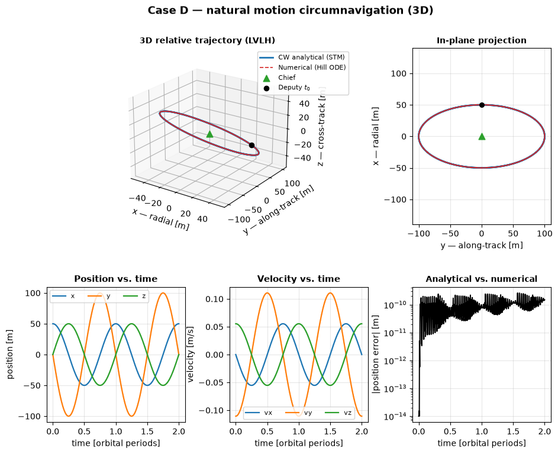

# ios-mission-planner

A Python toolkit for **in-orbit servicing (IOS) mission analysis and planning**.

The long-term goal is a mission planner that, given a deputy satellite on a parking orbit and a target (chief) satellite, computes an optimal sequence of maneuvers to bring the deputy from far-range phasing through close-range proximity operations to a final docking, accounting for the orbital and attitude dynamics of both satellites, mission safety constraints such as approach and keep-out ellipsoids, and eventually closed-loop relative navigation from noisy sensor data such as LiDAR.

This is being built up incrementally, starting from the dynamics layer. What exists today:

- **Relative motion** between a chief and a deputy: the linearized Hill-Clohessy-Wiltshire (HCW) equations, both integrated numerically and solved in closed form via the Clohessy-Wiltshire state transition matrix (STM).
- **Absolute (inertial) motion**: the two-body problem plus the J2 (Earth oblateness) perturbation.
- **Frame transformations** between the inertial frame and the chief's LVLH frame, so that maneuvers designed with linear relative-motion tools can be flown and checked against nonlinear orbits.
- **Relative-motion planning tools**: two-impulse CW targeting (the delta-v to go from one relative state to another in a fixed time), and a geometric decomposition of any relative orbit into a drift-free 2:1 ellipse plus drift, the basis for passively safe parking orbits.
- **Numerical propagation** via [heyoka.py](https://github.com/bluescarni/heyoka.py): equations of motion are defined as symbolic expressions and integrated with an adaptive-order Taylor series, JIT-compiled via LLVM, instead of a fixed-order Runge-Kutta scheme.
- **Safety checks**: keep-out zones around the chief, passive safety of planned burns against their own failure, and conical approach corridors, checked against both the linear relative-motion tools above and the nonlinear propagation.



*A drift-free, out-of-plane relative orbit (natural motion circumnavigation) around the chief, from [`examples/cw_fundamentals.ipynb`](examples/cw_fundamentals.ipynb): the CW closed-form solution and the numerical integration of the Hill equations agree down to numerical noise (bottom-right panel).*

## Installation

Requires [conda](https://conda.io) (e.g. [Miniforge](https://github.com/conda-forge/miniforge)). The dynamics modules depend on [heyoka.py](https://github.com/bluescarni/heyoka.py), which ships prebuilt binaries only through conda-forge (no Windows pip wheels), so this project is conda-first rather than pip/venv-based.

```bash
git clone https://github.com/giovannifacchinetti99/ios-mission-planner.git
cd ios-mission-planner

conda env create -f environment.yml
conda activate ios-mission-planner
```

`environment.yml` installs Python, heyoka.py, numpy, matplotlib, Jupyter, and the package itself in editable mode (via `pip install -e .` under the hood), so changes to `src/` are picked up immediately without reinstalling.

To run the example notebooks from this environment's Jupyter kernel:

```bash
python -m ipykernel install --user --name ios-mission-planner --display-name "Python (ios-mission-planner)"
```

## Contents

- `src/ios_mission_planner/dynamics/orbital/two_body.py`: two-body equations of motion in an inertial frame, as a symbolic heyoka ODE system, for absolute orbit propagation.
- `src/ios_mission_planner/dynamics/orbital/perturbations.py`: two-body dynamics with the J2 (oblateness) perturbation, as a symbolic heyoka ODE system.
- `src/ios_mission_planner/dynamics/relative/hill.py`: Hill-Clohessy-Wiltshire (HCW) equations of motion for a deputy relative to a chief on a circular reference orbit, as a symbolic heyoka ODE system.
- `src/ios_mission_planner/dynamics/relative/cw.py`: closed-form Clohessy-Wiltshire state transition matrix for analytical propagation of relative motion, and two-impulse targeting built on it.
- `src/ios_mission_planner/dynamics/relative/relative_orbit.py`: conversion between a relative state and its geometric description (2:1 ellipse size, phase, center, drift), and the drift-free ellipse through a given point.
- `src/ios_mission_planner/dynamics/relative/lvlh.py`: inertial to chief LVLH frame transformations of position and velocity.
- `src/ios_mission_planner/propagation/heyoka_propagator.py`: generic numerical propagator built on heyoka.py's Taylor-adaptive integrator.
- `src/ios_mission_planner/constants.py`: physical constants (gravitational parameter, radius, J2) for common central bodies.
- `src/ios_mission_planner/safety/keepout.py`: ellipsoidal keep-out zones around the chief, and a check of a relative trajectory against one.
- `src/ios_mission_planner/safety/passive_safety.py`: checks whether a planned burn's own failure to execute stays clear of a keep-out zone for a given time.
- `src/ios_mission_planner/safety/corridor.py`: conical approach corridors around a reference direction (e.g. the V-bar), and a check of a relative trajectory against one.
- `examples/cw_fundamentals.ipynb`: foundations of relative motion. How heyoka is used to integrate the Hill equations, free-motion cases such as the drift-free ellipse and the natural motion circumnavigation, two-impulse targeting, relative orbit elements explained one by one, and a capstone insertion onto a passively safe 2:1 ellipse.
- `examples/rendezvous_to_safety_ellipse.ipynb`: a complete approach from a parking orbit through phasing, a Hohmann transfer to a 5 km hold point, a far-range CW hop and insertion onto a 2:1 safety ellipse, flown with nonlinear two-body dynamics, with a delta-v budget and a J2 experiment.
- `examples/safety_fundamentals.ipynb`: keep-out zones, passive safety of planned burns, and approach corridors, demonstrated on the 2:1 safety ellipse and on two example hops that each pass one check and fail the other.

## Usage

Relative motion (HCW), numerically integrated:

```python
import numpy as np
from ios_mission_planner.dynamics.relative.hill import hill_equations_symbolic
from ios_mission_planner.propagation.heyoka_propagator import propagate

n = 0.0011  # mean motion [rad/s]
state0 = np.array([100.0, 0.0, 0.0, 0.0, 0.0, 0.0])
t_eval = np.linspace(0, 5400, 200)

solution = propagate(hill_equations_symbolic(), state0, t_eval, pars=[n])
```

Absolute (inertial) two-body motion, numerically integrated:

```python
import numpy as np
from ios_mission_planner.constants import MU_EARTH
from ios_mission_planner.dynamics.orbital.two_body import two_body_dynamics_symbolic
from ios_mission_planner.propagation.heyoka_propagator import propagate

state0 = np.array([6878.137, 0.0, 0.0, 0.0, 7.6126, 0.0])  # km, km/s
t_eval = np.linspace(0, 5677, 200)

solution = propagate(two_body_dynamics_symbolic(), state0, t_eval, pars=[MU_EARTH])
```

Two-impulse targeting from a hold point at y = -1000 m to one at y = -200 m, in 0.75 orbits:

```python
import numpy as np
from ios_mission_planner.dynamics.relative.cw import cw_targeting

n = 0.0011  # mean motion [rad/s]
T = 2 * np.pi / n

dv1, dv2 = cw_targeting(
    r0=[0.0, -1000.0, 0.0], v0=[0.0, 0.0, 0.0],
    rf=[0.0, -200.0, 0.0], vf=[0.0, 0.0, 0.0],
    t=0.75 * T, n=n,
)
```
